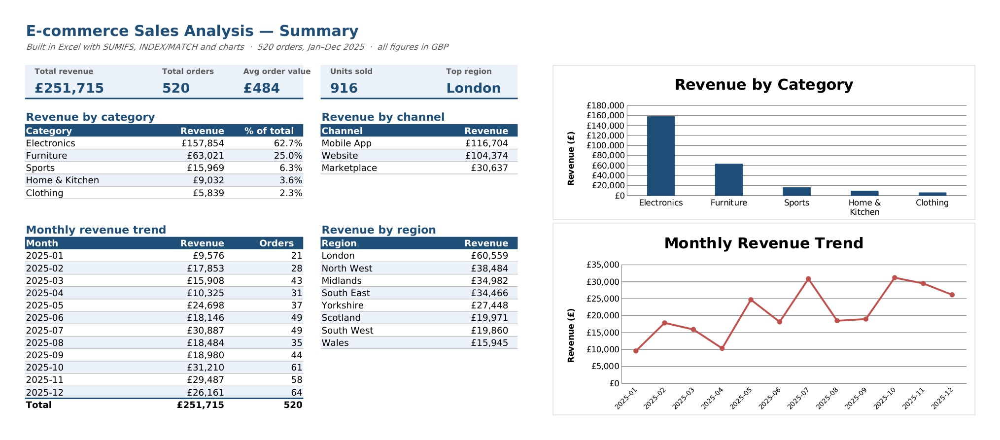

# E-commerce Sales Analysis (Excel)

An end-to-end sales analysis built in **Microsoft Excel**, turning 520 raw order
records into a clean summary dashboard of revenue drivers — by category, region,
channel, and month.

The focus is a realistic analyst workflow in Excel: aggregating raw transactions
with formulas, surfacing the key figures, and presenting them as charts a
business could act on.

## Summary dashboard



## Key findings

- **Total revenue £251,715 across 520 orders**, average order value ~£484.
- **Electronics dominates at 63% of revenue** (£157,854) — laptops and phones the
  main drivers — with Furniture a distant second at 25%.
- **London is the top region** (£60,559), well ahead of North West and the Midlands;
  revenue is geographically concentrated in the South East and North West.
- **Mobile App has overtaken Website** as the leading sales channel (£116,704 vs
  £104,374), with Marketplace a minor third.
- **Clear seasonal ramp** — monthly revenue builds through the year and peaks in
  November–December, consistent with pre-Christmas demand.

## What this demonstrates

| Skill | Where |
|-------|-------|
| Conditional aggregation | `SUMIFS` across category, region, channel, and month |
| Lookups | `INDEX`/`MATCH` to pull the top region and its revenue |
| KPIs | `SUM`, `COUNTA`, average order value |
| Data modelling | Added a `Month` field to enable trend analysis |
| Visualisation | Column chart (revenue by category) and line chart (monthly trend) |
| Communication | A single summary sheet a stakeholder can read at a glance |

## Files

```
ecommerce_analysis.xlsx   The workbook: Summary sheet (formulas + charts) and Data sheet (520 records)
images/                   Screenshot of the summary dashboard
```

> GitHub can't preview Excel files in the browser, so the screenshot above shows
> the analysis. Download `ecommerce_analysis.xlsx` to see the live formulas and charts.

## Method

The raw data is 520 e-commerce orders (2025) with region, channel, customer
segment, product, quantity, and price. The Summary sheet aggregates it entirely
with formulas (no hardcoded totals), so it recalculates if the data changes:

- Revenue by category / channel / region via `SUMIFS`
- Monthly revenue via `SUMIFS` on a derived `Month` column
- Top region via `INDEX(range, MATCH(MAX(...)))`
- KPIs via `SUM` / `COUNTA`

*Data is synthetic, generated for this project.*

## Tools

Microsoft Excel — SUMIFS, INDEX/MATCH, SUM/COUNTA, charts.
